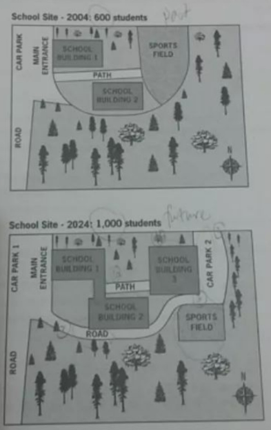

# 范文1

#### The diagrams below show the site of a school in 2004 and the plan for changes to the school site in 2024.

The two pictures compare the layout of a school as it was in the year 2004 with a proposed site design for the year 2024.

It is clear that main change for 2024 involves the addition of a new school building. The school will then be able to accommodate a considerably larger number of students.

In 2004, there were 600 pupils attending the school, and the two school buildings were separated by a path running from the main entrance to the sports field. By 2024, it is expected that there will be 1000 pupils, and a third building will have been constructed. Furthermore, the plan is to join the two original buildings together, creating a shorter path that links the buildings only.

As the third building and a second  car park will be built on the site of the original sports field, a new, smaller sports field will need to be laid. A new road will also be built from the main entrance to the second car park. Finally, no changes will be  made to the main entrancce and original car park.

### 分析

